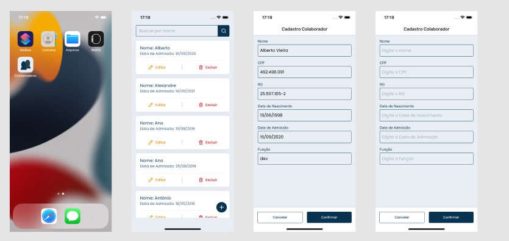

<h1 align="center">
  App de Colaboradores
</h1>

<h6>
App desenvolvido em React Native, que faz todo o CRUD para registro de colaboradores. O app se comunica com a <a href="https://github.com/luisescx/clientApi">API</a> para fazer a persistência dos dados.
</h6>

## :rocket: Como executar

<ul>
  <li>Clonar o projeto</li>
  <li>Instalar as depêndencias usando <strong>yarn</strong></li>
  <li><strong>iOS:</strong> instalar pod install, <strong>cd ios && pod install && cd ..</strong></li>
  <li><strong>Importante:</strong> copiar o arquivo <strong>.env.example</strong> e renomear para <strong>.env</strong> e alterar o <strong>ENV_BASE_URL</strong> para o seu IP, não usar localhost devido a algumas restrições do android, deve ser usado <strong>http e não https</strong></li>
  <li>Executar comando <strong>yarn start</strong> no diretório raiz</li>
  <li>Em outro terminal, também no diretório raiz, executar <strong>yarn android</strong> ou <strong>yarn ios</strong></li>
</ul>

## :speech_balloon: Funcionalidades

<ul>
  <li>Listagem dos colaboradores cadastrados</li>
  <li>Filtrar colaboradores pelo nome</li>
  <li>Editar, excluir e cadastrar novos colaboradores</li>
</ul>

## ⌨️ Tecnologias

<ul>
  <li>React Native</li>
  <li>TypeScript</li>
  <li>React Navigation</li>
  <li>React Native Splash Screen</li>
  <li>React Native SVG</li>
  <li>Styled Components</li>
  <li>react-native-masked-text</li>
  <li>react-native-config</li>
  <li>Axios</li>
</ul>
